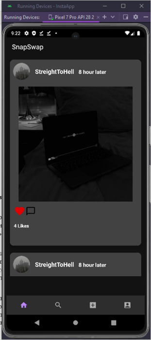
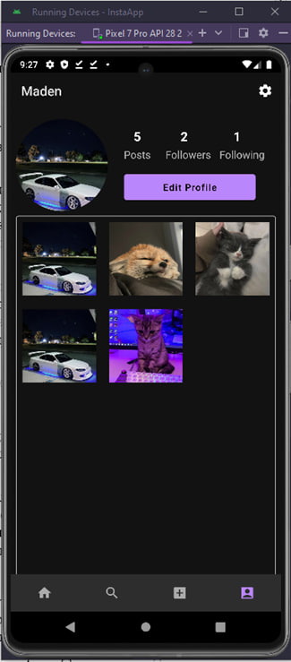

# 📸 PhotoApp

Android-приложение для хранения, просмотра и управления фотографиями с использованием **Firebase**.  
Разработано в рамках учебного проекта в **Astana IT University College**.

---

## 🖼️ Скриншоты

| Главный экран | Просмотр фото |
|---------------|----------|---------------|
|  |  |

> 📌 Помести скриншоты в папку `screenshots/` и обнови пути при необходимости.

---

## 🚀 Функционал

- Авторизация пользователей через Firebase Authentication  
- Загрузка и хранение фотографий в **Firebase Storage**  
- Хранение метаданных в **Firebase Realtime Database / Firestore**  
- Просмотр, удаление и сортировка фото  
- Минималистичный адаптивный интерфейс  

---

## 🧩 Технологии и стек

- **Язык:** Kotlin  
- **Архитектура:** MVVM  
- **Базы данных:** Firebase Firestore / Realtime Database  
- **Хранилище:** Firebase Storage  
- **Аутентификация:** Firebase Auth  
- **Библиотеки:** Glide, RecyclerView, ViewBinding  
- **Инструменты:** Android Studio, Gradle, Git  

---

## 💡 О проекте

Проект демонстрирует интеграцию Android-приложения с облачным backend’ом на базе Firebase.  
Реализованы авторизация, работа с файлами и онлайн-синхронизация данных.  
Цель — освоить принципы client–server взаимодействия и cloud-архитектуру в Android.

---

## 🔗 Автор

**Maden**  
📍 Astana, Kazakhstan  
[GitHub](https://github.com/IDGAFM)
